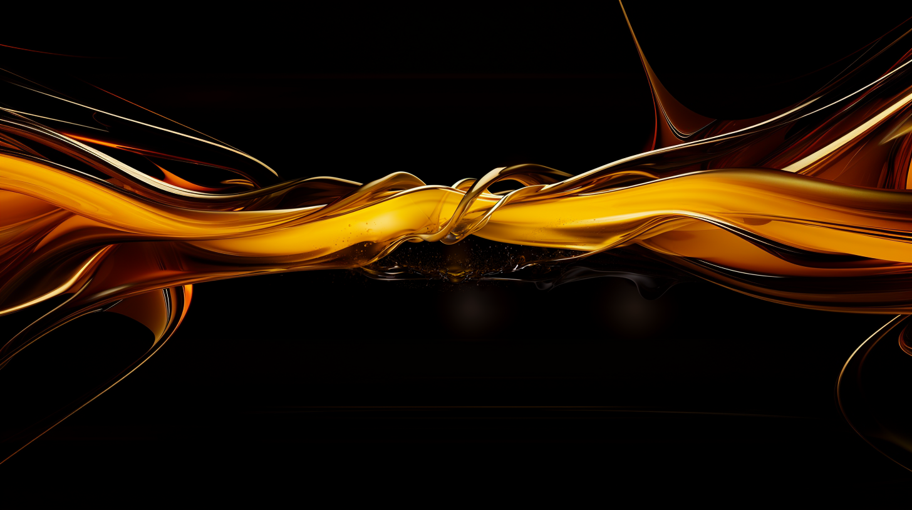
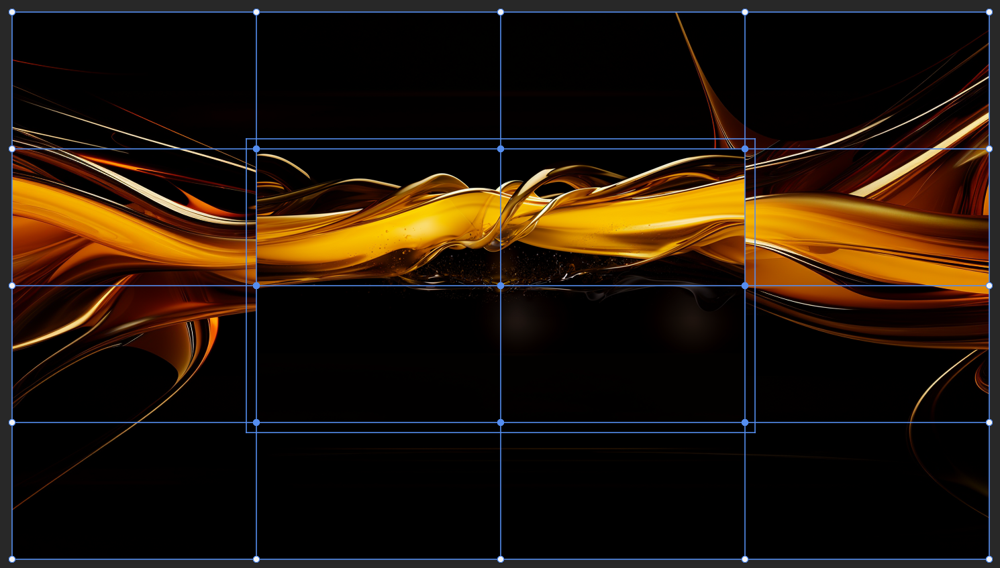
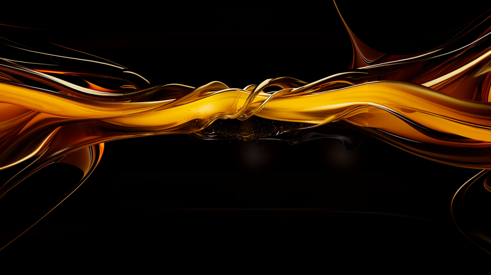
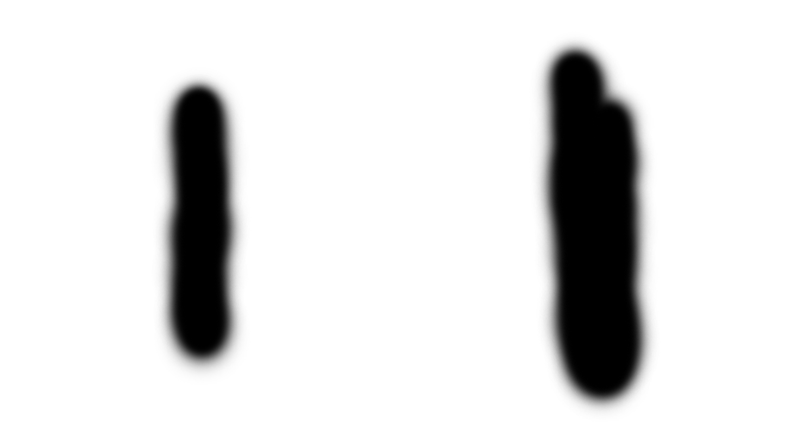
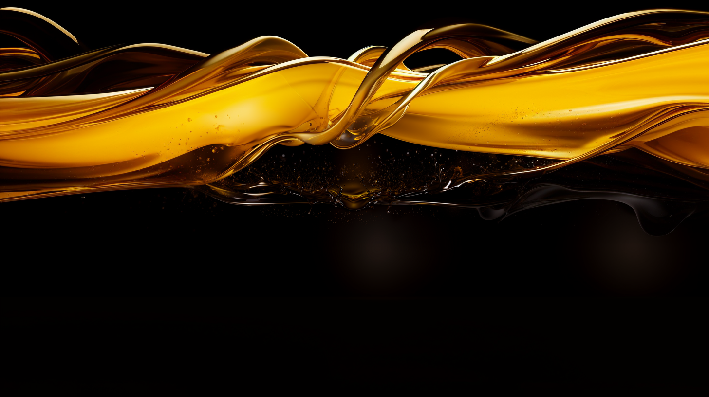
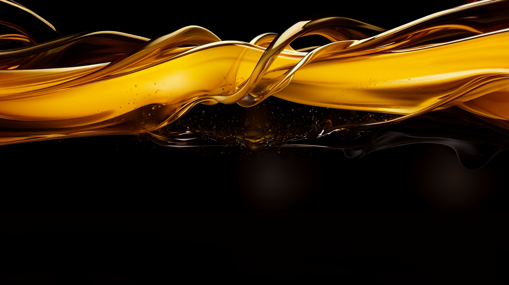

# Fix image shift

It sometimes happens that midjourney shifts the image slightly on zoom out. This must be fixed before creating the animation.

## Fix image shift in Photoshop

The image where the shift happened is called *image 2* in this guide, the one before it *image 1*
Using Photoshop, fix as follows.

#### Fix image 2

* Open image 2

  
  
* Place image 1 on top and **transform** it **50%, 50%**

  
  
* Select image 2, **Edit > Transform > Warp** and choose **Grid: 4 x 4** and select the center control points

  
  
* Move the control points until it matches image 1
 
  
  
* Add a mask to image 1 and with a soft brush, paint over the edges to blend both images. Make sure to only work on the edges and work with the minimal width possible.

  

* Image 2 is now ready. 

  
  
#### Fix image 1

Depending on how strong the edits on image 2 are, it might be needed to fix image 1 too, to cover up the tweaks on the edges

* Open image 1

  
  
* Place the **fixed** version of image 2 on top

* Add a mask to image 2 and invert it to complete hide it

* With a white brush, reveal the edges

* Image 1 is now ready

  
  
## Result

Before and after

  
  
  
